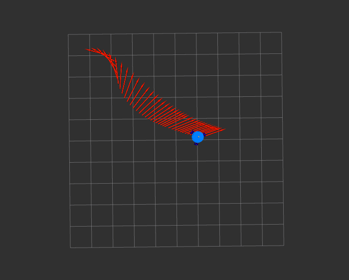
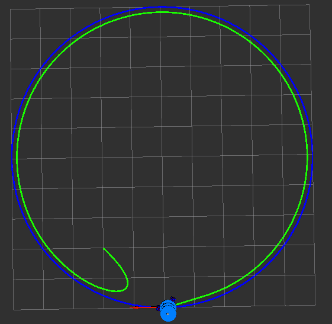

# 3-Wheeled Omni-directional Mobie robot
## Download and Installation
```
$ mkdir -p catkin_ws/src
$ cd catkin_ws/src
$ git clone https://github.com/duynamrcv/omni_robot.git
$ cd ..
$ catkin_make
```
## Simulation on Gazebo
```
roslaunch omni_gazebo gazebo.launch
```
## Fake Omni Robot simulation on RViz
```
roslaunch omni_fake omni_fake.launch
```

## Teleop controller
```
rosrun omni_teleop teleop
```
## Topic
* /cmd_vel <```geometry_msgs/Twist```> - The robot will get the value from this topic to control the robot velocity.
* /odom <```navigation_msgs/Odometry```> - The robot state include real pose and velocity of robot
* /scan <```sensor_msgs/LaserScan```> - The lidar 2D topic which show the scan value of lidar
* /camera/rgb/image_raw <```sensor_msgs/Image```> - The rbg topic which show the depth image stream (8UC3) of rgbd camera
* /camera/depth/image_raw <```sensor_msgs/Image```> - The depth topic which show the depth image stream (32FC1) of rgbd camera

## Controller for Omni Robot
### Move to Pose
First, run omni fake
```
roslaunch omni_fake omni_fake.launch
```
Then, run the controller
```
$ rosrun omni_control move2pose
```
On Rviz simulator, select ```2D Nav Goal``` on the toolbar and select goal position for robot. <br>
Results: <br>


### Pure Pursuit
First, run omni fake and path generator
```
$ roslaunch omni_fake omni_fake.launch
$ roslaunch omni_path_generator simple_path.launch
```
Then, run the controller
```
$ rosrun omni_control pure_pursuit
```
