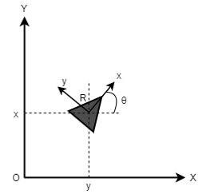

# Omni directional Mobile Robots

The robot state: $\mathbf{x} = [x, y, \theta]^T$  
The control: $\mathbf{u} = [v_x, v_y, \omega]^T$ 

The relationship between robot coordinate and the global coordinate:
$$ \dot{x} = v_x\cos{\theta} - v_y\sin{\theta} $$
$$ \dot{y} = v_x\sin{\theta} + v_y\cos{\theta} $$
$$ \dot{\theta} = \omega $$

The equations above is in the matrix form:
$$ \left[ \begin{matrix} \dot{x} \\ \dot{y} \\ \dot{\theta} \end{matrix} \right] = \left[ \begin{matrix} \cos{\theta} & -\sin{\theta} & 0 \\ \sin{\theta} & \cos{\theta} & 0 \\ 0 & 0 & 1 \end{matrix} \right] \left[ \begin{matrix} v_x \\ v_y \\ \omega \end{matrix} \right] $$
$$ \to \dot{\mathbf{x}} = \mathbf{Q}\mathbf{u} $$
The discrete form:
$$ \mathbf{x}_{k+1} = \mathbf{x}_k + \mathbf{Q}\mathbf{u}_k\Delta t $$
where $\Delta t$ is the time step.